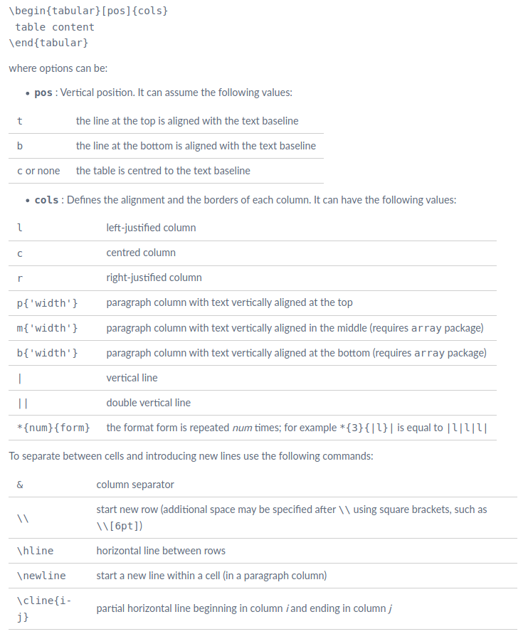

# Latex

## Tikz / Pgfplot

### [Flowcharts](https://www.overleaf.com/learn/latex/LaTeX_Graphics_using_TikZ:_A_Tutorial_for_Beginners_(Part_3)%E2%80%94Creating_Flowcharts)

1. 模板

   ```latex
      \tikzstyle{startstop} = [rectangle, rounded corners, minimum width = 2cm, minimum height=1cm,text centered, align=center, draw = black, fill=red!30]

      \tikzstyle{io} = [trapezium, trapezium left angle=70, trapezium right angle=110, minimum height=1cm, text centered, align=center,draw=black, fill=blue!30]

      \tikzstyle{process} = [rectangle, minimum width=3cm, minimum height=1cm, align=center, draw=black, text width = 7cm, fill=orange!30]

      \tikzstyle{decision} = [diamond, aspect = 3, text centered,align=center, draw=black, fill=green!30] 

      \tikzstyle{arrow} = [thick,->,>=stealth]
   ```

2. Coordinate calc

   ```latex
   \node (name) at ($(io1.south) + (0,-1cm)$) [process, anchor = north] {}
   ```
   
3. Node placement 

   ```latex
   \node (pro4) [process, below  =of pro3.south] {}
   % do not use below of = 
   ```

4. Orthogonal coordinate system identifiers

   ```latex
   \node (pro6) at  (pro5 |- pro3) [process, text width=5.5cm] {}
   % -|: (vertical component of the first and horizontal component of the second)
   % |-: horizontal component of the first and vertical component of the second
   ```

5. Relative between

   ```latex
   \node (pro6) at  ($(pro5) !0.5!( pro1)$) [process, text width=5.5cm] {}
   ```

6. Combination with |- and $ () $

   ```latex
   \coordinate (pro6y) at ($(pro1)!.5!(pro5)$);
   \node (pro6) at  (pro5 |- pro6y) [process, text width=5.5cm] {}
   % can not directly comine |- with $$
   ```

### Tikz mark with call out

1. example 

   ```latex
   \usepackage{tikz}
   \usepackage{pgfplots}
   \usetikzlibrary{calc,decorations.pathreplacing,positioning}
   \usetikzlibrary{shapes.geometric, arrows.meta}
   \newcommand{\tikzmark}[3][]{\tikz[remember picture,baseline] \node [anchor=base,inner sep=0pt,outer sep =0pt,#1](#2) {$#3$};}
   \begin{align*}
   \boldsymbol{V}_{i}^{t+1} & =\tikzmark{A}{\omega\boldsymbol{V}_{i}^{t}}+\tikzmark[blue!80]{B}{\alpha\boldsymbol{\epsilon_{1}}\left(\boldsymbol{pbest}_{i}^{t}-\boldsymbol{x_{i}^{t}}\right)}+\tikzmark[red!80]{C}{\beta\boldsymbol{\epsilon_{2}}(\boldsymbol{gbest}^{t}-\boldsymbol{x_{i}^{t}})}\\
   \boldsymbol{x}_{i}^{t+1} & =\boldsymbol{x}_{i}^{t}+\boldsymbol{V}_{i}^{t+1}\\
   \end{align*}

   \begin{tikzpicture}[overlay,remember picture,node distance =0.15cm]
      \node(name2)[text width =3.5cm,above = of B,yshift=0.3cm,blue!80]{Cognitive Component};
      \node(name3)[text width =3cm,base right = of name2,xshift=0.7cm,red!80]{Social Component};	
      \node(name1)[text width =0.5cm,base left = of name2,xshift=-1cm]{Inertia};
      \draw [-stealth,thick] (name1) to [in=90,out=-90] (A.north);
      \draw [-stealth,thick] (name2) to [in=90,out=-90] (B.north);
      \draw [-stealth,thick] (name3) to [in=90,out=-90] (C.north);
   \end{tikzpicture}
   ```

2. Important notes
   * Put tikz environment into the adjust box 
      ```latex
      \adjustbox{max height=\dimexpr\textheight-5.5cm\relax,
      max width=\textwidth}{
      \only<2>{\begin{tikzpicture}[remember picture,overlay]
      \node[rectangle callout, text width =3cm, text centered, fill=LRed, callout absolute pointer={(a.south)}] at ($(a.mid)+(1cm,-4cm)$) {G02};
      \end{tikzpicture}}
      ```

### [Basics](https://www.overleaf.com/learn/latex/LaTeX_Graphics_using_TikZ:_A_Tutorial_for_Beginners_(Part_1)%E2%80%94Basic_Drawing)

### 3D plot

```latex
\addplot3 [contour gnuplot = {labels = false} ]{sin(deg(x))+cos(deg(y))}   # deg(x)
```

### Notes

1. [水平间距](www.ctex.org/documents/latex/graphics/node31.html)
    LATEX 在排列图形的时候实际上与排列其它的像文字这样的对象是一样的， 了解到这一点很重要。举例来说，如果行尾不是以 % 结束的话， LATEX 会 自动在两行之间加进一个字符的水平间距.
2. 单栏 8.3cm, 双栏 17.6cm; 单栏 3.26 inch, 双栏 6.52 inch
3. 12pt Articel: textwidth: 5.39749in, 13.70499cm  
4. 11pt Article: textwidth: 5.1191in, 


## [Texlive](https://www.tug.org/texlive/quickinstall.html)

### [How to Remove](https://tex.stackexchange.com/questions/95483/how-to-remove-everything-related-to-tex-live-for-fresh-install-on-ubuntu)

```shell
sudo apt-get purge texlive*
sudo rm -rf /usr/local/texlive/* and rm -rf ~/.texlive*
sudo rm -rf /usr/local/share/texmf
sudo rm -rf /var/lib/texmf
sudo rm -rf /etc/texmf
sudo apt-get remove tex-common --purge
rm -rf ~/.texlive

find -L /usr/local/bin/ -lname /usr/local/texlive/*/bin/* | xargs rm
```


### [How to install](https://stone-zeng.github.io/2018-05-13-install-texlive-ubuntu/)

### Post-install: Setting PATH

```shell
gedit ~/.bashrc   
# 在最后添加
export PATH=/usr/local/texlive/2018/bin/x86_64-linux:$PATH
export MANPATH=/usr/local/texlive/2018/texmf-dist/doc/man:$MANPATH
export INFOPATH=/usr/local/texlive/2018/texmf-dist/doc/info:$INFOPATH
source ~/.bashrc  #更新
# 保证sudo模式下路径仍然可用
sudo visudo
# 找到
' secure_path="/usr/local/sbin:/usr/local/bin:/usr/sbin:/usr/bin:/sbin:/bin:/snap/bin"
'
# 在前面添加texlive路径
secure_path="/usr/local/texlive/2018/bin/x86_64-linux:/usr/local/sbin:/usr/local/bin:/usr/sbin:/usr/bin:/sbin:/bin:/snap/bin"

# 检查
tlmgr -v
pdftex -v
xetex -v
luatex -v
sudo cp /usr/local/texlive/2019/texmf-var/fonts/conf/texlive-fontconfig.conf /etc/fonts/conf.d/09-texlive.conf
```

### Check the platform

```shell
arch
```

## Longtable

```latex
    \begin{longtable}{cccccccc}
        \caption{Comparisons of PMAM, COBRA, eDIRECT-C, SADE-kNN, SACOBRA and SCGOSR}\\
        \toprule 
        Prob. & Criteria & PMAM & COBRA & eDIRECT-C & SADE-kNN & SACOBRA & SCGOSR\\
        \endfirsthead
        \multicolumn{8}{c}%
        {{\bfseries \tablename\ \thetable{} -- continued from previous page}} \\
        Prob. & Criteria & PMAM & COBRA & eDIRECT-C & SADE-kNN & SACOBRA & SCGOSR\\
        \endhead
   \end{longtable}

```

## [Texstudio](https://code.launchpad.net/~sunderme/+archive/ubuntu/texstudio)

```shell
sudo add-apt-repository ppa:sunderme/texstudio
sudo apt-get update
sudo apt-get install texstudio
```

### Macros

```Texstudtio
%SCRIPT
txt = cursor.selectedText()
editor.write("\\boldsymbol{"+txt+"}")
cursor.clearSelection()
```


## Latexindent

```shell
sudo cpan Log::Log4perl
sudo cpan Log::Dispatch::File
```

## Table 

### Basics

1. Control the vertical space of position

   ```latex
   \renewcommand{\arraystretch}{1.0}    !should be in a group before tabular
   ```

2. Control the column span

   ```latex
   \begin{table}
   \setlength\tabcolsep{2pt}
   \end{table}
   ```

### Tabularx 

1. Change the default X column (p[box]) to m[box]

   ```latex
   \renewcommand{\tabularxcolumn}[1]{m{#1}}
   \renewcommand{\tabularxcolumn}[1]{>{\small}m{#1}}
   ```

## Latexdiff

1. Common usage 

   ```latex
      latexdiff -t CTRADITIONAL draft.tex revision.tex > diff.tex
      \providecommand{\DIFdel}[1]{} % Don't show deleted text
      \providecommand{\DIFaddtex}[1]{{\protect\hl{#1}}} %DIF PREAMBLE
   ```

2. Hide discarded text

   ```latex
   \providecommand{\DIFdel}[1]{\texorpdfstring{\DIFdeltex{#1}}{}} %DIF PREAMBLE
   \providecommand{\DIFdel}[1]{} % Don't show deleted text
   ```

3. Change color

   ```latex
   \providecommand{\DIFadd}[1]{{\color{red}\uline{#1}}}
   \providecommand{\DIFaddtex}[1]{{\protect\hl{#1}}} %DIF PREAMBLE

   ```
   

4. Option clash

   ```latex
   % \RequirePackage[stable]{footmisc} %DIF PREAMBLE  comment this package
   ```

   

### Equation 

1. Long equation in two column

   ```latex
   \resizebox{0.8\columnwidth}{!}{
   \begin{minipage}{\linewidth}
      \begin{equation}
         \begin{aligned} \tiny
         	\end{aligned}
      \end{equation}
   \end{minipage}}
   ```

   ```latex
   \adjustbox{max height=\dimexpr\textheight-5.5cm\relax, max width=\textwidth, center}{
      \begin{minipage}{1.0\textwidth}
      \begin{equation}

      \end{equation}
      \end{minipage}
      }

   ```
### Appendix

1. Change Appendix name

   ```latex
      \renewcommand\appendixname{Appendix A: Benchmark Examples}
      \renewcommand\appendixpagename{Appendix A: Benchmark Examples}
   ```

2. Change Appedix format

   ```latex
   \renewcommand{\thesubsection}{\arabic{subsection}.} 
   ```
