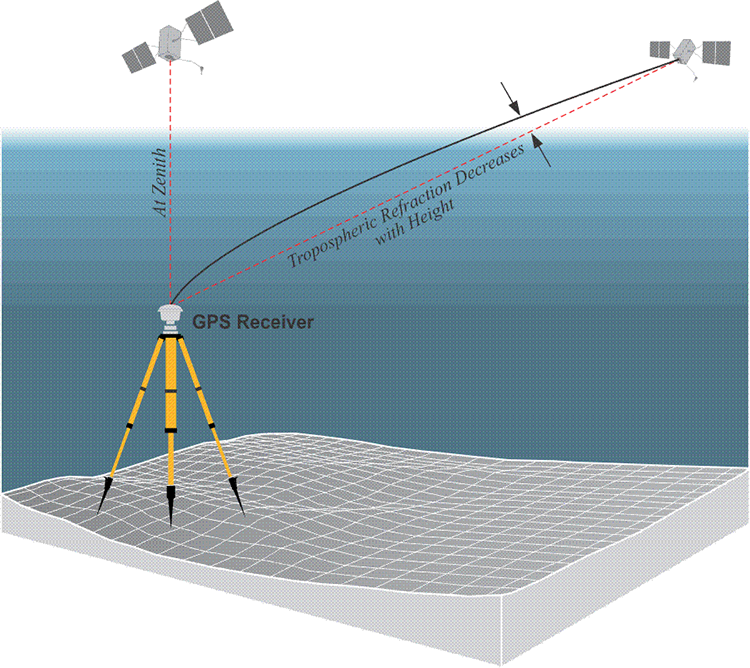
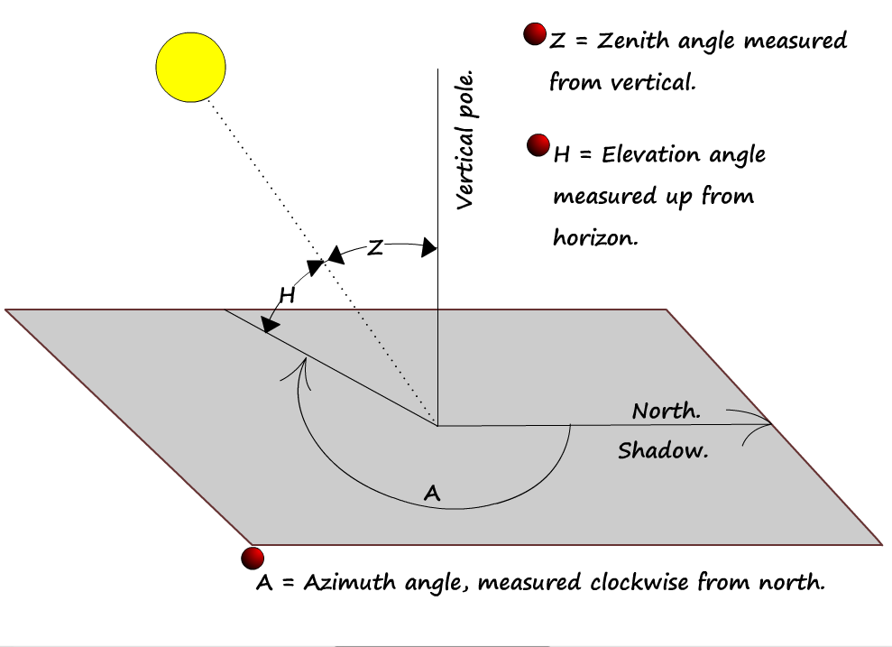

# Tropospheric Effect
##   [The Tropospheric Effect](https://www.e-education.psu.edu/geog862/node/1719)

### Troposphere

   - The troposphere and the ionosphere are by no means alike in their effect on the satellite’s signal. While the troposphere is refractive, its refraction of a GPS satellite’s signal is **not related to its frequency**. The refraction is tantamount to a delay in the arrival of a GPS satellite's signal. **It can also be conceptualized as a distance added to the range the receiver measures between itself and the satellite.**  
   - In the **ionosphere**, density affects the severity of the delay of the GPS signal as it travels through the troposphere. For example, when a satellite is **close to the horizon**, the delay of the signal caused by the troposphere is **maximized**. The tropospheric delay of the signal from a satellite at **zenith**, directly above the receiver, is **minimized**.
	
### Satellite elevation and tropospheric effect
   - The GPS signal that travels the shortest path through the troposphere will be the least delayed by it. So, even though the delay at **an elevation angle of 90° at sea level will only be about 2.4 meters**, it can increase to about 9.3 meters at 75° and up to 20 meters at 10°. There is less tropospheric delay at higher altitudes.

###  Atmosphere and Baseline Length

  
There are other practical consequences of the atmospheric biases. As mentioned earlier, the character of the atmosphere is never homogeneous; therefore, the importance of atmospheric modeling increases as the distance between GPS receivers grows.

# [On Ground-Based GPS Tropospheric Delay Estimation](http://athene-forschung.unibw.de/doc/85240/85240.pdf)

Objective: To estimate wet tropospheric delays that can be converted into integrated water vapor and thereby serve as a valuable input into numerical weather and climate models.

## Brief Overview of the lower atmosphere

- The atmosphere is a mixture of dry gases that primarily contribute to the hydrostatic delay  and water vapor which is responsible for the wet delay.

- *Troposphere*: 0-12km with linear temperature decrease
- *Tropopause* ( 对流层顶 ) :  12-16km, -60℃ to -80℃.
- *Stratosphere* (平流层顶): 16-50 km, a slow temperature increase.
- *Water vaper contents*: 'most' below 4km, 'no' above 12km

## Pressure

- Sea level pressure 1013 hPa = 101.3 kPa

## Temperature

- *Temperature lapse rate*: -5~-7 K/km below  the tropopause height, remains constant at tropopause, slowly increase in the stratosphere.

## Water Vapor

- not homogenous both horizontal and vertical
- *water vapor* decreases rapidly with height as the atmosphere gets colder

## Modeling of Tropospheric Delays
Note: The term *tropospheric* propagation delay is used here despite the fact that the hydrostatic component is also influenced by gases above the troposphere.

### Generalized Functional Description 

*Tropospheric Delay*:  The geometrical distance differs from the actual ray path
$$
\Delta S_{k}^{i} = \int_{act} n(s)\cdot ds - \int_{vac} ds \\
$$

$$
\begin{align*}
\Delta S_{k}^{i} & :\text{total/neutral slant path dely from receiver}\,A\,\text{to satellite}\,i\\
n & :\text{index of atmospheric refraction}\\
ds & :\text{differential increment in distance with respect to the line of sight}\\
act & :\text{ray path passing from receiver in direction to satellite through the atmosphere}\\
vac & :\text{virtual path of a ray passing from receiver in direction to satellite through vacumm}
\end{align*}
$$

The *neutral slant path delay* can be separated into 
$$
\Delta S_{k}^{i}=\Delta S_{hyd}+\Delta S_{wet}
$$

$$
\begin{align*}
\Delta S_{hyd} & :\text{hydrostatic slant path delay}\\
\Delta S_{wet} & :\text{wet slant path delay}
\end{align*}
$$

- *hydrostatic*/*dry* component: mainly by dry air, but water vapor actually actively influences **both the wet and the hydrostatic delay** components
- *wet* component: mainly caused by the vertical distribution of water vapor in the tropopause

  

### Tilting of the atmosphere @{Ghoddousi-Fard2009}

Tilting the zenith direction in the mapping function by a small angle $\beta$ may represent a tropospheric gradient. 
$$
\cos(\tilde{z})=\cos(\beta)\cos(z)+\sin(\beta)\sin(z)\cos(A-A_{0})
$$

$$
\begin{align*}
A & :\text{the azimuth of the observation}\\
A_{0} & :\text{the azimuth of the tropospheric zenith direction}\,\tilde{z} \\
 & :\text{with respect to the geometric zenith direction}\,z
\end{align*}
$$

Assume $\beta$ is small:
$$
\begin{align*}
\tilde{z} & =z+\delta z\\
\cos(z+\delta z) & =\cos(z)+\beta\sin(z)\cos(A-A_{0})\\
\delta z & =-\beta\cos(A-A_{0})\\
\tilde{z} & =z-\beta\cos(A-A_{0})
\end{align*}
$$
By defining: $x=-\beta \cos(A_{0})$ and $y=-\beta \sin(A_{0})$ , we can write:
$$
\tilde{z}=z+x\cos(A)+y\sin(A)
$$
Hence:
$$
\begin{align*}
f(\tilde{z}) & =f(z+\delta z)\\
f(\tilde{z}) & =f(z)+\frac{\partial f}{\partial z}(z+\delta z-z)\\
 & =f(z)+\frac{\partial f}{\partial z}\delta z\\
 & =f(z)+\frac{\partial f}{\partial z}x\cos(A)+\frac{\partial f}{\partial z}y\sin(A)
\end{align*}
$$

### Hopfield Hydrostatic Delay Model
The dry atmosphere is in hydrostatic equilibrium, following the ideal gas laws of Boyle- Mariotte and Gay-Lussac, assuming gravity and density do not change with height:
$$
\begin{align*}
dp & =-g\cdot\rho\cdot dH\\
dp & :\text{differential change in pressure}\\
g & :\text{gravity}\\
\rho & :\text{density of dry air}\\
dH & :\text{differential change in height}
\end{align*}
$$

Density can also be expressed by 
$$
\begin{align*}
p & =\rho\cdot R_{d}\cdot T\\
\Leftrightarrow\rho & =\frac{p}{R_{d}\cdot T}
\end{align*}
$$

$$
\begin{align*}
p & :\text{pressure}\\
T & :\text{temperature}\\
R_{d} & :\text{specific gas constant of dry air}
\end{align*}
$$

Leads to 
$$
\begin{align*}
dp & =-g\cdot\frac{p}{R_{d}\cdot T}\cdot dH\\
\Leftrightarrow\frac{dp}{p} & =-\frac{g}{R_{d}\cdot T}\cdot dH
\end{align*}
$$
Considering the vertical evolution of the temperature in the troposphere can be approximated by a linear trend using the temperature lapse rate:
$$
\begin{align*}
T & =f(h)\\
 & =T_{0}+\beta\cdot H\\
\\
T & :\text{temperature as function of altitude}\\
T_{0} & :\text{temperature at surface (or antenna) height }h=0\,m\\
\beta & :\text{temperature lapse rate}\\
H & :\text{height above sea level}
\end{align*}
$$
Then 
$$
\frac{dp}{\rho}=-\frac{g}{R_{d}\cdot(T_{0}+\beta\cdot H)}\cdot dH
$$
Integrate from $H_{0}=0\,m$ to $H$, and $p_{0}$ to $p_{d}$ 
$$
\begin{align*}
\int_{p_{0}}^{p}\frac{1}{\rho}dp & =-\frac{g}{R_{d}}\cdot\int_{H_{0}}^{H}\frac{1}{T_{0}+\beta\cdot H}dH\\
\Rightarrow\ln\left(\frac{p}{p_{0}}\right) & =\ln\left[\left(\frac{T_{0}+\beta\cdot H}{T_{0}}\right)^{-\frac{g}{R_{d}\cdot\beta}}\right]\\
\Rightarrow p & =p_{0}\cdot\left(\frac{T_{0}+\beta\cdot H}{T_{0}}\right)^{-\frac{g}{R_{d}\cdot\beta}}
\end{align*}
$$

### Saastamoinen Hydrostatic Delay Model
Assumption: the dry atmosphere is in hydrostatic equilibrium:
$$
dp = -g(h)\cdot \rho(H)\cdot dH
$$
